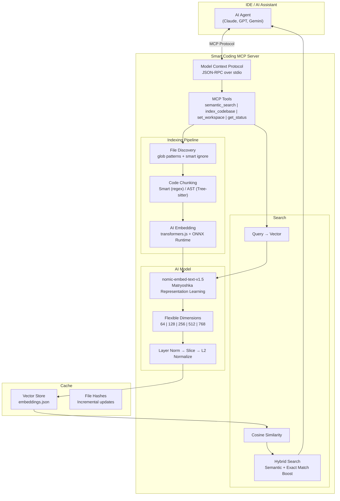

# Smart Coding MCP

[](https://www.npmjs.com/package/smart-coding-mcp)
[](https://www.npmjs.com/package/smart-coding-mcp)
[](https://opensource.org/licenses/MIT)
[](https://nodejs.org/)

An extensible Model Context Protocol (MCP) server that provides intelligent semantic code search for AI assistants. Built with local AI models using Matryoshka Representation Learning (MRL) for flexible embedding dimensions (64-768d), with runtime workspace switching and comprehensive status reporting.

### Available Tools

| Tool                   | Description                                       | Example                                         |
| ---------------------- | ------------------------------------------------- | ----------------------------------------------- |
| `semantic_search`      | Find code by meaning, not just keywords           | `"Where do we validate user input?"`            |
| `index_codebase`       | Manually trigger reindexing                       | Use after major refactoring or branch switches  |
| `clear_cache`          | Reset the embeddings cache                        | Useful when cache becomes corrupted             |
| `d_check_last_version` | Get latest version of any package (20 ecosystems) | `"express"`, `"npm:react"`, `"pip:requests"`    |
| `e_set_workspace`      | Change project path at runtime                    | Switch to different project without restart     |
| `f_get_status`         | Get server info: version, index status, config    | Check indexing progress, model info, cache size |

## What This Does

AI coding assistants work better when they can find relevant code quickly. Traditional keyword search falls short - if you ask "where do we handle authentication?" but your code uses "login" and "session", keyword search misses it.

This MCP server solves that by indexing your codebase with AI embeddings. Your AI assistant can search by meaning instead of exact keywords, finding relevant code even when the terminology differs.


## Why Use This

**Better Code Understanding**

- Search finds code by concept, not just matching words
- Works with typos and variations in terminology
- Natural language queries like "where do we validate user input?"

**Performance**

- Pre-indexed embeddings are faster than scanning files at runtime
- Smart project detection skips dependencies automatically (node_modules, vendor, etc.)
- Incremental updates - only re-processes changed files

**Privacy**

- Everything runs locally on your machine
- Your code never leaves your system
- No API calls to external services

## Installation

Install globally via npm:

```bash
npm install -g smart-coding-mcp
```

To update to the latest version:

```bash
npm update -g smart-coding-mcp
```

## Configuration

Add to your MCP configuration file. The location depends on your IDE and OS:

| IDE                  | OS      | Config Path                                                       |
| -------------------- | ------- | ----------------------------------------------------------------- |
| **Claude Desktop**   | macOS   | `~/Library/Application Support/Claude/claude_desktop_config.json` |
| **Claude Desktop**   | Windows | `%APPDATA%\Claude\claude_desktop_config.json`                     |
| **Cascade (Cursor)** | All     | Configured via UI Settings > Features > MCP                       |
| **Antigravity**      | macOS   | `~/.gemini/antigravity/mcp_config.json`                           |
| **Antigravity**      | Windows | `%USERPROFILE%\.gemini\antigravity\mcp_config.json`               |

Add the server configuration to the `mcpServers` object in your config file:

### Option 1: Absolute Path (Recommended)

```json
{
  "mcpServers": {
    "smart-coding-mcp": {
      "command": "smart-coding-mcp",
      "args": ["--workspace", "/absolute/path/to/your/project"]
    }
  }
}
```

### Option 2: Multi-Project Support

```json
{
  "mcpServers": {
    "smart-coding-mcp-frontend": {
      "command": "smart-coding-mcp",
      "args": ["--workspace", "/path/to/frontend"]
    },
    "smart-coding-mcp-backend": {
      "command": "smart-coding-mcp",
      "args": ["--workspace", "/path/to/backend"]
    }
  }
}
```

### Option 3: Auto-Detection (May Not Work)

> ⚠️ **Warning:** Most MCP clients (including Antigravity and Claude Desktop) do NOT support `${workspaceFolder}` variable expansion. The server will exit with an error if the variable is not expanded.

For clients that support dynamic variables (VS Code, Cursor):

```json
{
  "mcpServers": {
    "smart-coding-mcp": {
      "command": "smart-coding-mcp",
      "args": ["--workspace", "${workspaceFolder}"]
    }
  }
}
```

| Client           | Supports `${workspaceFolder}` |
| ---------------- | ----------------------------- |
| VS Code          | Yes                           |
| Cursor (Cascade) | Yes                           |
| Antigravity      | No ❌                         |
| Claude Desktop   | No ❌                         |

## Environment Variables

Override configuration settings via environment variables in your MCP config:

| Variable                           | Type    | Default                          | Description                                |
| ---------------------------------- | ------- | -------------------------------- | ------------------------------------------ |
| `SMART_CODING_VERBOSE`             | boolean | `false`                          | Enable detailed logging                    |
| `SMART_CODING_BATCH_SIZE`          | number  | `100`                            | Files to process in parallel               |
| `SMART_CODING_MAX_FILE_SIZE`       | number  | `1048576`                        | Max file size in bytes (1MB)               |
| `SMART_CODING_CHUNK_SIZE`          | number  | `25`                             | Lines of code per chunk                    |
| `SMART_CODING_MAX_RESULTS`         | number  | `5`                              | Max search results                         |
| `SMART_CODING_SMART_INDEXING`      | boolean | `true`                           | Enable smart project detection             |
| `SMART_CODING_WATCH_FILES`         | boolean | `false`                          | Enable file watching for auto-reindex      |
| `SMART_CODING_SEMANTIC_WEIGHT`     | number  | `0.7`                            | Weight for semantic similarity (0-1)       |
| `SMART_CODING_EXACT_MATCH_BOOST`   | number  | `1.5`                            | Boost for exact text matches               |
| `SMART_CODING_EMBEDDING_MODEL`     | string  | `nomic-ai/nomic-embed-text-v1.5` | AI embedding model to use                  |
| `SMART_CODING_EMBEDDING_DIMENSION` | number  | `256`                            | MRL dimension (64, 128, 256, 512, 768)     |
| `SMART_CODING_DEVICE`              | string  | `cpu`                            | Inference device (`cpu`, `webgpu`, `auto`) |
| `SMART_CODING_CHUNKING_MODE`       | string  | `smart`                          | Code chunking (`smart`, `ast`, `line`)     |
| `SMART_CODING_WORKER_THREADS`      | string  | `auto`                           | Worker threads (`auto` or 1-32)            |

**Example with environment variables:**

```json
{
  "mcpServers": {
    "smart-coding-mcp": {
      "command": "smart-coding-mcp",
      "args": ["--workspace", "/path/to/project"],
      "env": {
        "SMART_CODING_VERBOSE": "true",
        "SMART_CODING_BATCH_SIZE": "200",
        "SMART_CODING_MAX_FILE_SIZE": "2097152"
      }
    }
  }
}
```

**Note**: The server starts instantly and indexes in the background, so your IDE won't be blocked waiting for indexing to complete.

## How It Works



### Tech Stack

| Component     | Technology                            |
| ------------- | ------------------------------------- |
| **Protocol**  | Model Context Protocol (JSON-RPC)     |
| **AI Model**  | nomic-embed-text-v1.5 (MRL)           |
| **Inference** | transformers.js + ONNX Runtime        |
| **Chunking**  | Smart regex / Tree-sitter AST         |
| **Search**    | Cosine similarity + exact match boost |

### Search Flow

Query → Vector embedding → Cosine similarity → Ranked results

## Examples

**Natural language search:**

Query: "How do we handle cache persistence?"

Result:

```javascript
// lib/cache.js (Relevance: 38.2%)
async save() {
  await fs.writeFile(cacheFile, JSON.stringify(this.vectorStore));
  await fs.writeFile(hashFile, JSON.stringify(this.fileHashes));
}
```

**Typo tolerance:**

Query: "embeding modle initializashun"

Still finds embedding model initialization code despite multiple typos.

**Conceptual search:**

Query: "error handling and exceptions"

Finds all try/catch blocks and error handling patterns.

## Privacy

- AI model runs entirely on your machine
- No network requests to external services
- No telemetry or analytics
- Cache stored locally in `.smart-coding-cache/`

## Technical Details

**Embedding Model**: nomic-embed-text-v1.5 via transformers.js v3

- Matryoshka Representation Learning (MRL) for flexible dimensions
- Configurable output: 64, 128, 256, 512, or 768 dimensions
- Longer context (8192 tokens vs 256 for MiniLM)
- Better code understanding through specialized training
- WebGPU support for up to 100x faster inference (when available)

**Legacy Model**: all-MiniLM-L6-v2 (fallback)

- Fast inference, small footprint (~100MB)
- Fixed 384-dimensional output

**Vector Similarity**: Cosine similarity

- Efficient comparison of embeddings
- Normalized vectors for consistent scoring

**Hybrid Scoring**: Combines semantic similarity with exact text matching

- Semantic weight: 0.7 (configurable)
- Exact match boost: 1.5x (configurable)

## Research Background

This project builds on research from Cursor showing that semantic search improves AI coding agent performance by 12.5% on average across question-answering tasks. The key insight is that AI assistants benefit more from relevant context than from large amounts of context.

See: https://cursor.com/blog/semsearch

## License

MIT License

Copyright (c) 2025 Omar Haris

Permission is hereby granted, free of charge, to any person obtaining a copy
of this software and associated documentation files (the "Software"), to deal
in the Software without restriction, including without limitation the rights
to use, copy, modify, merge, publish, distribute, sublicense, and/or sell
copies of the Software, and to permit persons to whom the Software is
furnished to do so, subject to the following conditions:

The above copyright notice and this permission notice shall be included in all
copies or substantial portions of the Software.

THE SOFTWARE IS PROVIDED "AS IS", WITHOUT WARRANTY OF ANY KIND, EXPRESS OR
IMPLIED, INCLUDING BUT NOT LIMITED TO THE WARRANTIES OF MERCHANTABILITY,
FITNESS FOR A PARTICULAR PURPOSE AND NONINFRINGEMENT. IN NO EVENT SHALL THE
AUTHORS OR COPYRIGHT HOLDERS BE LIABLE FOR ANY CLAIM, DAMAGES OR OTHER
LIABILITY, WHETHER IN AN ACTION OF CONTRACT, TORT OR OTHERWISE, ARISING FROM,
OUT OF OR IN CONNECTION WITH THE SOFTWARE OR THE USE OR OTHER DEALINGS IN THE
SOFTWARE.
